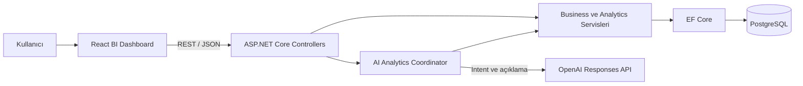

# QueryPilot

QueryPilot, PostgreSQL verisini ASP.NET Core üzerinden analiz eden ve AI'ı yalnızca kullanıcı sorusunu anlamak ile backend sonucunu açıklamak için kullanan bir Business Intelligence API projesidir.

## Mimari



PostgreSQL gerçek business kayıtlarını tutar; backend doğrulama, finansal hesap ve analytics sonuçlarının tek kaynağıdır. AI yalnızca doğal dil sorusunu typed intent'e çevirir ve backend'in verdiği structured sonucu açıklar. AI database'e bağlanmaz, raw SQL çalıştırmaz ve finansal sayı hesaplamaz.

## Gereksinimler

| Araç | Gereksinim |
|---|---|
| .NET SDK | `8.0.424` (`global.json` ile sabitlenmiştir) |
| PostgreSQL | PostgreSQL 18; yerel kurulum bu sürümle doğrulanmıştır |
| Node.js | `22.13.0` veya üzeri |
| npm | Node.js ile gelen güncel npm |
| PowerShell | Migration ve test kurulum komutları için PowerShell 7 önerilir |
| OpenAI API key | Yalnız doğal dil AI endpointi için isteğe bağlıdır |

## Sıfırdan kurulum ve çalıştırma

Aşağıdaki komutlar repository kökünde ve sırasıyla çalıştırılır.

1. PostgreSQL'de uygulama rolünü ve development database'ini oluşturun:

```sql
CREATE ROLE querypilot_admin WITH LOGIN CREATEDB CREATEROLE PASSWORD '<local-admin-password>';
CREATE ROLE querypilot_app WITH LOGIN PASSWORD '<development-password>';
CREATE DATABASE querypilot_dev OWNER querypilot_app;
```

`querypilot_admin` yalnız yerel integration-test rolünü hazırlamak için kullanılır; uygulama runtime'da daha düşük yetkili `querypilot_app` rolüyle bağlanır.

2. Connection string ve isteğe bağlı AI ayarlarını source code dışında saklayın:

```powershell
dotnet user-secrets set "ConnectionStrings:DefaultConnection" "Host=127.0.0.1;Port=5432;Database=querypilot_dev;Username=querypilot_app;Password=<development-password>" --project src/QueryPilot.Api
dotnet user-secrets set "Development:PostgresAdminPassword" "<local-admin-password>" --project src/QueryPilot.Api
dotnet user-secrets set "AI:Provider" "OpenAI" --project src/QueryPilot.Api
dotnet user-secrets set "AI:Model" "<model-id>" --project src/QueryPilot.Api
dotnet user-secrets set "AI:ApiKey" "<your-api-key>" --project src/QueryPilot.Api
dotnet user-secrets set "AI:TimeoutSeconds" "30" --project src/QueryPilot.Api
```

AI kullanılmayacaksa dört `AI:*` komutu atlanabilir. Doğrudan analytics endpointleri API key olmadan çalışır.

3. Araçları yükleyin ve migration'ları uygulayın:

```powershell
dotnet tool restore
dotnet restore QueryPilot.sln
dotnet tool run dotnet-ef database update `
  --project src/QueryPilot.Api/QueryPilot.Api.csproj `
  --startup-project src/QueryPilot.Api/QueryPilot.Api.csproj
```

4. Backend'i Development profilinde başlatın:

```powershell
dotnet run --project src/QueryPilot.Api --launch-profile http
```

Backend `http://localhost:5199`, Swagger ise `http://localhost:5199/swagger` adresinde açılır. Boş development database'inde `DemoSeed:Enabled=true` ayarı deterministik demo verisini ilk başlangıçta otomatik ekler.

5. Ayrı bir terminalde frontend'i başlatın:

```powershell
Set-Location frontend
Copy-Item .env.example .env.local
npm ci
npm run dev
```

Frontend `http://localhost:5173` adresindedir.

6. Otomatik kontrolleri çalıştırın:

```powershell
Set-Location ..
.\scripts\setup-integration-tests.ps1
dotnet test QueryPilot.sln --configuration Release
Set-Location frontend
npm test
npm run lint
npm run build
```

## Proje yapısı

```text
QueryPilot/
|-- QueryPilot.sln
|-- global.json
`-- src/
    `-- QueryPilot.Api/
        |-- Features/
        |   |-- Categories/
        |   |-- Products/
        |   |-- Customers/
        |   |-- Orders/
        |   |-- Returns/
        |   |-- Analytics/
        |   `-- Ai/
        |-- Data/
        |   |-- AppDbContext.cs
        |   |-- Configurations/
        |   |-- Migrations/
        |   `-- Seed/
        |-- Common/
        |   |-- Exceptions/
        |   |-- Validation/
        |   `-- Responses/
        |-- Configuration/
        `-- Program.cs
```

Tek deploy birimi `QueryPilot.Api` projesidir. Microservice, CQRS, MediatR veya ek bir uygulama katmanı bu yapının parçası değildir.

Veri modeli ve ilişki kararları için [Database Modeli](docs/database-model.md) belgesine bakın.

## Namespace kuralı

C# namespace'leri proje kökü `QueryPilot.Api` ile başlar ve dosyanın klasör yolunu izler. Örneğin:

- `Features/Categories/Category.cs` -> `QueryPilot.Api.Features.Categories`
- `Data/Configurations/CategoryConfiguration.cs` -> `QueryPilot.Api.Data.Configurations`
- `Common/Exceptions/NotFoundException.cs` -> `QueryPilot.Api.Common.Exceptions`
- `Configuration/AiOptions.cs` -> `QueryPilot.Api.Configuration`

## Yerel secret ayarları

Yerel PostgreSQL connection string'i .NET User Secrets içinde `ConnectionStrings:DefaultConnection` anahtarıyla tutulur. Değer source code veya `appsettings` dosyalarına yazılmaz.

OpenAI adapter'ı Responses API kullanır. Provider, model, API key ve timeout değerleri `AI` configuration bölümünden okunur. API anahtarını source code veya `appsettings.json` içine yazmayın; yerel geliştirmede user-secrets kullanın.

```powershell
dotnet user-secrets set "AI:Provider" "OpenAI" --project src/QueryPilot.Api
dotnet user-secrets set "AI:Model" "<model-id>" --project src/QueryPilot.Api
dotnet user-secrets set "AI:ApiKey" "<your-api-key>" --project src/QueryPilot.Api
dotnet user-secrets set "AI:TimeoutSeconds" "30" --project src/QueryPilot.Api
```

Deployment ortamında aynı değerler `AI__Provider`, `AI__Model`, `AI__ApiKey` ve `AI__TimeoutSeconds` environment variable'larıyla sağlanabilir. Timeout 1-120 saniye arasında olmalıdır. API key eksikken uygulama ve analytics endpointleri çalışmaya devam eder; yalnız AI çağrısı ortak 503 contractıyla sonuçlanır.

AI request logları provider, model, operasyon, sonuç ve süreyi içerir. API key, kullanıcı sorusu, analytics JSON'u ve provider'a gönderilen tam prompt loglanmaz.

Soru anlama çağrısı yalnız structured JSON intent döndürür. Desteklenen analizler `salesSummary`, `salesTrend`, `topProducts`, `categoryPerformance` ve `returnAnalysis` değerleridir. Intent ayrıca dönem veya açık tarihleri, ürün/kategori adını, top-products metriğini ve sonucu sınırlandıran limit değerini taşıyabilir. AI katmanı SQL üretmez ve metrikleri kendisi hesaplamaz.

Typed intent backend'e iletilmeden önce doğrulanır. Bütün analizler geçerli ve en fazla beş yıllık bir UTC tarih aralığı gerektirir; desteklenen relative Türkçe dönemler backend `TimeProvider` değeriyle çözülür. Sales trend yalnız daily/weekly/monthly granularity, top-products yalnız quantity/revenue metric ve 1-50 limit kabul eder. Kategori adı verilirse gerçek database kaydı aranır. Doğrulama başarısız olursa analytics servisi çağrılmaz.

Soru gerekli alanları içermiyorsa coordinator `NeedsClarification` sonucu döndürür. Bu response özgün soruyu, mevcut typed intenti, eksik veya belirsiz alanları, izin verilen değerleri ve yeniden gönderme talimatını içerir. Örneğin “En iyi ürünler hangileri?” sorusu için tarih aralığı ile quantity/revenue metriği istenir; rastgele tarih veya metric seçilmez. Ürün ve kategori adlarında yalnız kesin database eşleşmesi kabul edilir.

Doğrulanmış analytics sonucu provider'a JSON DTO olarak yalnız kısa Türkçe açıklama üretmesi için gönderilir. AI'a DTO dışında sayı, yüzde, tarih, ürün, müşteri veya kategori eklememesi ve değerleri yeniden hesaplamaması açıkça bildirilir. Açıklama en fazla 500 karakterdir; kaynak JSON'da bulunmayan numeric değer içeren veya sınırı aşan metin `RejectedUnsafe` olarak işaretlenir ve frontend'e gösterilecek metin taşınmaz. Provider hatasında açıklama `Unavailable` olur. Her iki durumda da backend'in hesapladığı `data` aynen korunur; frontend `explanation.status` alanına göre açıklamayı isteğe bağlı gösterebilir.

BI kapsamı dışındaki sorular `Unsupported` durumuyla, desteklenen beş analiz ve örnek soru listesiyle cevaplanır; analytics sorgusu çalıştırılmaz. Intent provider timeout'u, 429/5xx cevabı, bağlantı hatası veya geçersiz provider çıktısı nedeniyle çıkarılamazsa ortak ve detay sızdırmayan 503 response'u kullanılır. Açıklama çağrısı analytics hesabından sonra başarısız olursa response numeric `data` alanını korur ve kullanıcıya güvenli bir `warning` verir. Doğrudan `/api/analytics/*` endpointleri AI servisinden ve API key'den bağımsızdır.

`AiAnalyticsCoordinator`, doğrulanmış typed intenti sabit bir enum switch'iyle yalnız ilgili `IAnalyticsService` metoduna yönlendirir. Sales trend granularity; top products metric, limit ve kesin eşleşmiş category id parametreleriyle çağrılır. AI tarafından sağlanan method adı, reflection veya SQL çalıştırılmaz. Relative Türkçe dönemler backend `TimeProvider` üzerinden kesin UTC başlangıç-dahil/bitiş-hariç aralığına çevrilmeden analytics çağrısı yapılmaz.

Doğal dil analytics endpointi `POST /api/ai/query` adresindedir. `question` zorunludur, yalnız boşluk içeremez ve en fazla 2000 karakter olabilir.

```json
{
  "question": "Son 3 ayın aylık satış trendini göster."
}
```

Başarılı response `status`, analiz türü ve kullanılan UTC parametreleri taşıyan `intent`, gerçek backend sonucu olan `data`, trend analizlerinde ayrıca `chartData` ve isteğe bağlı `explanation` alanlarını içerir. Clarification ve unsupported sonuçları aynı contract içinde kendi typed alanlarını kullanır. Provider tamamen kullanılamıyorsa endpoint ortak, detay sızdırmayan Problem Details 503 cevabı döndürür. Swagger XML açıklamaları request modeli, endpoint davranışı ve 200/400/503 response tiplerini gösterir.

Intent extraction, validation, analytics routing ve açıklama adımlarının özeti için [AI query akışı](docs/ai-query-flow.md) belgesine bakın.

## Ana endpointler

| Method | Endpoint | Amaç |
|---|---|---|
| `GET/POST` | `/api/categories` | Kategori listeleme ve oluşturma |
| `GET/PUT/DELETE` | `/api/categories/{id}` | Kategori detay, güncelleme ve pasifleştirme |
| `GET/POST` | `/api/products` | Ürün listeleme ve oluşturma |
| `GET/PUT/DELETE` | `/api/products/{id}` | Ürün detay, güncelleme ve pasifleştirme |
| `GET/POST` | `/api/customers` | Müşteri listeleme ve oluşturma |
| `GET/PUT/DELETE` | `/api/customers/{id}` | Müşteri detay, güncelleme ve pasifleştirme |
| `GET/POST` | `/api/orders` | Sipariş listeleme ve oluşturma |
| `GET` | `/api/orders/{id}` | Sipariş ve iade özetli satır detayı |
| `POST` | `/api/returns` | Tamamlanmış sipariş satırından iade oluşturma |
| `GET` | `/api/analytics/summary` | Gelir, sipariş, adet ve önceki dönem özeti |
| `GET` | `/api/analytics/sales-trend` | Günlük, haftalık veya aylık satış trendi |
| `GET` | `/api/analytics/top-products` | Adet veya gelire göre en iyi ürünler |
| `GET` | `/api/analytics/categories` | Kategori geliri ve payı |
| `GET` | `/api/analytics/returns` | İade oranı, nedenleri ve ürünleri |
| `POST` | `/api/ai/query` | Doğal dil sorusunu doğrulanmış analytics sonucuna çevirme |
| `GET` | `/api/health` | API ve PostgreSQL sağlık durumu |

Liste endpointleri ortak `items`, `page`, `pageSize`, `totalCount` ve `totalPages` sözleşmesini; hatalar ise `application/problem+json` biçimini kullanır. Tam request/response şemaları Swagger'dadır.

## Swagger ve CORS politikası

Swagger doküman başlığı `QueryPilot API` ve versiyonu `v1` olarak tanımlıdır. Endpointler `Categories`, `Products`, `Customers`, `Orders`, `Returns`, `Analytics` ve `AI` etiketleri altında gruplanır. Request/response şemaları, validation/business hata tipleri ve ortak 500 cevabı OpenAPI'de gösterilir; bütün enum seçenekleri JSON contractıyla uyumlu string değerlerdir. Swagger'daki açıklama ve örnekler yalnız API dokümantasyonudur; production verisi, analytics sonucu veya seed talimatı değildir.

Swagger yalnız `Swagger:Enabled=true` ve environment Production değilken açılır. Development ayarında açıktır. Production ortamında configuration yanlışlıkla true olsa bile middleware eklenmez ve `/swagger/v1/swagger.json` 404 döndürür.

CORS izinleri `Cors:AllowedOrigins` exact origin listesinden okunur. Development için varsayılan frontend origin'i `http://localhost:5173` değeridir. Production en az bir origin ister ve yalnız HTTPS scheme/host/port originlerini kabul eder; wildcard, path, query, fragment, embedded credential ve duplicate değerler startup sırasında reddedilir. `Cors:AllowCredentials=true` kullanılabilir, ancak wildcard hiçbir durumda kabul edilmez.

Production örneği:

```text
Cors__AllowedOrigins__0=https://app.example.com
Cors__AllowedOrigins__1=https://admin.example.com
Cors__AllowCredentials=true
```

Listede bulunmayan origin'in preflight isteği başarılı CORS header'ı alamaz. Origin karşılaştırması exact yapılır; `https://app.example.com` izni başka scheme, subdomain veya portu kapsamaz.

## Frontend bağımsız HTTP doğrulaması

`http/QueryPilot.Api.http` dosyası; health, temel kayıtlar, sipariş, iade, beş analytics endpointi, AI sorgusu ve limit hatalarını frontend olmadan çağırmak için hazır istekler içerir. Uygulamayı `http://localhost:5199` adresinde çalıştırdıktan sonra `.http` destekleyen bir IDE veya HTTP client ile istekler tek tek gönderilebilir. Dosyanın başındaki ID değerleri kullanılan demo verisine göre güncellenmelidir.

`QueryPilot.Api.Tests` projesi solution'a dahildir. Order testleri istemcinin finansal toplam gönderemediğini, `OrderItem.UnitPrice`/`LineTotal` snapshotlarını ve `Order.TotalAmount` değerini backend ürün fiyatlarından hesaplandığını doğrular. Return testleri partial/full/over-return kurallarını ve `Return.Amount` değerinin güncel Product fiyatı yerine OrderItem fiyat snapshotından üretildiğini kapsar. Invalid business senaryolarında bir EF `SaveChangesInterceptor` ile `SaveChanges` çağrı sayısının sıfır kaldığı kontrol edilir.

`QueryPilot.Api.IntegrationTests` ayrı bir PostgreSQL integration test projesidir. Testler yalnız loopback PostgreSQL sunucusunu kabul eder, `querypilot_test_<guid>` adında benzersiz bir database oluşturur, migrationları uygular, elle hesaplanabilir fixture'ı yükler ve test sonunda yalnız bu kesin isim kalıbındaki database'i kaldırıp silindiğini doğrular. Development veya production database adı hiçbir zaman test bağlantısı olarak kullanılmaz.

Integration testleri yerelde `IntegrationTests:AdminConnectionString` user-secret'ından, CI ortamında ise `QUERYPILOT_INTEGRATION_ADMIN_CONNECTION_STRING` değişkeninden database oluşturma/silme yetkisi olan yalnız test amaçlı PostgreSQL rolünü okur. İki ayar da yoksa PostgreSQL testleri açıkça skipped olarak raporlanır; uygulamanın development connection string'ine geri düşülmez.

```powershell
.\scripts\setup-integration-tests.ps1
dotnet test tests/QueryPilot.Api.IntegrationTests/QueryPilot.Api.IntegrationTests.csproj
```

Setup scripti mevcut `Development:PostgresAdminPassword` user-secret'ını yalnız rol kurulumunda kullanır. `querypilot_test_admin` rolünü `LOGIN` ve `CREATEDB` yetkileriyle oluşturur veya parolasını yeniler; role `SUPERUSER` ya da `CREATEROLE` vermez. Oluşturulan bağlantı parolasını terminale yazmadan user-secrets'a kaydeder.

Fixture; summary, günlük/haftalık/aylık trend, top-products quantity/revenue sıralaması, kategori payı ve önceki dönem karşılaştırması, iade oranı/nedenleri/ürünleri, boş dönem, yıl geçişi ve sıfır satış paydası senaryolarını kapsar.

`WebApplicationFactory` contract testleri aynı disposable PostgreSQL database üzerinde Category, Product, Order, Return, Analytics ve AI endpointlerini gerçek HTTP pipeline'ından geçirir. AI çağrılarında deterministik `FakeAiService` kullanılır; model validation ve ortak 400/404/409/500/503 Problem Details response'ları HTTP seviyesinde doğrulanır.

PostgreSQL kayıtları değiştiğinde Top Products, Sales Summary, Category Performance ve aynı doğal dil AI sorusunun nasıl güncellendiğini gösteren kısa before/after sunumu için [CV dynamic analytics demo senaryosuna](docs/cv-demo-dynamic-analytics.md) bakın.

Gerçek OpenAI testi normal test paketinden ayrı ve varsayılan olarak skipped bir smoke testtir. Yalnız bilinçli olarak aşağıdaki üç environment variable sağlandığında ücretli provider çağrısı yapar:

```powershell
$env:QUERYPILOT_RUN_OPENAI_SMOKE = "true"
$env:AI__ApiKey = "<your-api-key>"
$env:AI__Model = "<model-id>"
dotnet test tests/QueryPilot.Api.Tests/QueryPilot.Api.Tests.csproj --filter "Category=OpenAiSmoke"
```

## Yerel PostgreSQL

Development veritabanı PostgreSQL 18 üzerinde çalışır. Cluster verisi `%LOCALAPPDATA%\QueryPilot\PostgreSQL18\data` altında tutulur ve yalnız `127.0.0.1:5432` üzerinden erişilir. Host bağlantıları SCRAM-SHA-256 parola doğrulaması kullanır.

`QueryPilotPostgreSQL18` adlı kullanıcı görevi, PostgreSQL'i Windows oturumu açıldığında otomatik olarak başlatır. Görevin durumunu kontrol etmek için:

```powershell
Get-ScheduledTask -TaskName "QueryPilotPostgreSQL18"
```

Sunucuyu başlatmak için:

```powershell
& "$env:ProgramFiles\PostgreSQL\18\bin\pg_ctl.exe" start `
  -D "$env:LOCALAPPDATA\QueryPilot\PostgreSQL18\data" `
  -l "$env:LOCALAPPDATA\QueryPilot\PostgreSQL18\postgres.log"
```

Sunucuyu durdurmak için:

```powershell
& "$env:ProgramFiles\PostgreSQL\18\bin\pg_ctl.exe" stop `
  -D "$env:LOCALAPPDATA\QueryPilot\PostgreSQL18\data"
```

Uygulama `querypilot_dev` veritabanına yalnız `querypilot_app` rolüyle bağlanır. Connection string ve parolalar Git dışında .NET User Secrets içinde tutulur.

## Migration ve demo verisi

Repository-local EF Core aracını ve migrationları çalıştırmak için:

```powershell
dotnet tool restore
dotnet tool run dotnet-ef database update `
  --project src/QueryPilot.Api/QueryPilot.Api.csproj `
  --startup-project src/QueryPilot.Api/QueryPilot.Api.csproj
```

Development ortamında `DemoSeed:Enabled` açık olduğunda boş veritabanına deterministik demo veri eklenir. Seed yaklaşık bir yıllık döneme yayılan 10 kategori, 100 ürün, 500 müşteri ve bunlardan türetilen sipariş, sipariş satırı ve iade kayıtlarını oluşturur. Herhangi bir business verisi varsa seed atlanır; böylece yeniden çalıştırma duplicate kayıt üretmez.

Temel `appsettings.json` içinde seed kapalıdır ve uygulama ayrıca yalnız `Development` ortamında seed çalıştırır. Bu nedenle production ortamında demo veri oluşturulmaz.

Demo seed kapsamı otomatik testle korunur: 10 kategori, 100 ürün, 500 müşteri ve 1.200 sipariş oluşturulur; completed/pending/cancelled siparişler, dört iade nedeni, aylık trend, önceki dönem karşılaştırması, quantity/revenue top products, bütün kategoriler ve iade analytics'i için pozitif veri bulunduğu doğrulanır. Seeder ikinci kez çalıştığında kayıt sayıları değişmez.

## Demo soruları

`POST /api/ai/query` için önerilen demo sırası:

| Senaryo | Örnek soru | Beklenen durum |
|---|---|---|
| Sales summary | `Bu ay satışlarımız nasıl?` | `Completed` ve structured satış özeti |
| Sales trend | `Son 3 ayın aylık satış trendini göster.` | `Completed` ve chart data |
| Top products | `Son 3 ayda adet bazında en çok satan 5 ürün ne?` | `Completed`, quantity metriği ve limit 5 |
| Category performance | `Geçen ay kategori performansını göster.` | `Completed` ve kategori gelir/pay listesi |
| Return analysis | `Son 30 günün iade analizini göster.` | `Completed` ve iade metrikleri |
| Clarification | `En iyi ürünler hangileri?` | `NeedsClarification`; tarih ve metric istenir |
| Unsupported | `Yarın Antalya'da hava nasıl?` | `Unsupported`; analytics çağrılmaz |

AI açıklaması kapalı veya geçici olarak kullanılamaz olsa bile `/api/analytics/*` endpointleri ve completed AI response içindeki backend `data` alanı geçerliliğini korur.

## 5-7 dakikalık dinamik veri demosu

1. **0:00-1:00 - Mimari:** PostgreSQL'in gerçek veri, backend'in hesaplama, AI'ın yalnız intent/açıklama sorumluluğunu gösterin.
2. **1:00-2:00 - Başlangıç sonucu:** Aynı tarih aralığında Sales Summary, Top Products ve Category Performance sonuçlarını açın; lider ürünü ve toplam geliri kaydedin.
3. **2:00-3:30 - Database değişikliği:** Aktif bir ürün için completed siparişler ekleyerek adet ve gelirini belirgin biçimde artırın.
4. **3:30-4:30 - Analytics tekrarı:** Aynı sorguları yeniden çalıştırın; gelir artışının eklenen sipariş toplamına, ürün sıralaması ve kategori payının yeni kayıtlara göre değiştiğine dikkat çekin.
5. **4:30-5:30 - AI grounding:** Aynı doğal dil sorusunu yeniden gönderin; AI açıklamasının eski değeri değil güncel structured analytics sonucunu kullandığını gösterin.
6. **5:30-6:30 - Koruma:** Cancelled veya geçersiz siparişin analytics sonucunu değiştirmediğini ve belirsiz sorunun clarification döndürdüğünü gösterin.
7. **6:30-7:00 - Kapanış:** Otomatik testleri, Swagger contractını ve secretların repository dışında tutulduğunu gösterin.

Tekrar üretilebilir ayrıntılı before/after senaryosu için [dinamik analytics demo belgesine](docs/cv-demo-dynamic-analytics.md) bakın.

## Bilinen sınırlamalar

- Authentication ve authorization henüz yoktur. API doğrudan public internete açılmamalı; production erişimi ağ veya platform seviyesinde sınırlandırılmalıdır.
- Sipariş durumu değiştiren endpoint yoktur. Yeni siparişler `Pending` oluşur; analytics yalnız `Completed` siparişleri kullanır.
- İade yalnız completed sipariş satırından oluşturulur; bağımsız iade listeleme endpointi yoktur. İade özeti sipariş detayında görünür.
- AI endpointi provider/model/API key gerektirir ve demo soruları Türkçe akış için optimize edilmiştir. Doğrudan analytics endpointleri AI'dan bağımsızdır.
- Demo seed yalnız boş database'de ve `Development` ortamında çalışır; production'da otomatik seed kapalıdır.
- CSV/Excel export, scheduled reports, gerçek zamanlı güncelleme, cache ve çok kiracılı yapı MVP kapsamında değildir.
- Frontend ve backend ayrı süreçlerdir; production API adresi ve exact CORS originleri deployment sırasında ayrıca yapılandırılmalıdır.

## Nice to Have backlog

- Authentication, role-based authorization ve audit log
- Sipariş durum workflow'u ve iade listeleme/yönetim ekranı
- CSV/Excel export ve scheduled e-posta raporları
- Gelişmiş tarih/kategori/ürün filtreleri ve kaydedilebilir dashboard görünümleri
- Cache, background jobs, rate limiting ve daha ayrıntılı observability
- Docker/CI-CD otomasyonu, cloud secret yönetimi ve otomatik rollback
- Çoklu dil, erişilebilirlik denetimi ve genişletilmiş browser E2E testleri
