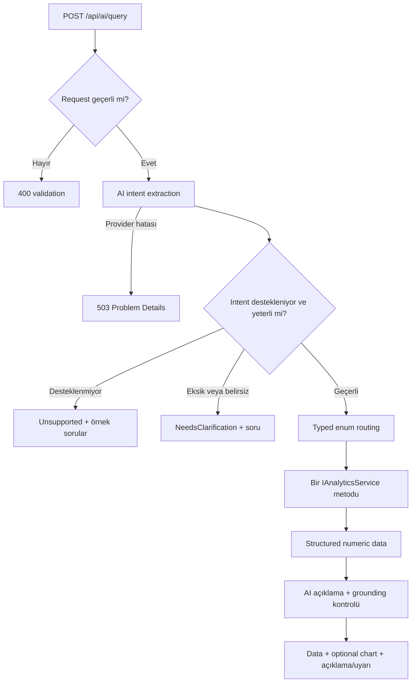

# AI query akışı

`POST /api/ai/query` doğal dil sorusunu yorumlar; bütün satış ve iade hesapları backend analytics servisinde kalır.

Unsupported ve clarification dalları analytics/database sorgusu çalıştırmaz. Provider açıklama aşamasında kullanılamazsa structured numeric data korunur ve response yalnız güvenli bir uyarı ekler. Direct `/api/analytics/*` endpointleri AI provider'dan bağımsızdır.
