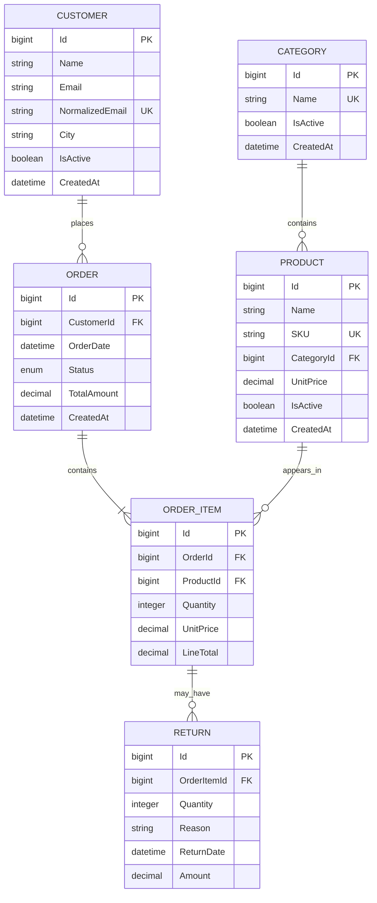

# QueryPilot Database Modeli

Bu belge veri modeli kararlarını tanımlar. Entity sınıfları bu sözleşmeye göre aşamalı oluşturulur; database kuralları EF Core configuration dosyalarında uygulanır.

## Entity ve ilişki diyagramı

## Zorunlu alanlar

| Entity | Zorunlu alanlar | Temel sorumluluk |
| --- | --- | --- |
| `Category` | `Id`, `Name`, `IsActive`, `CreatedAt` | Ürünleri gruplar. `Name` benzersizdir. |
| `Product` | `Id`, `Name`, `SKU`, `CategoryId`, `UnitPrice`, `IsActive`, `CreatedAt` | Satılabilir ürünü ve güncel liste fiyatını tutar. `SKU` benzersizdir. |
| `Customer` | `Id`, `Name`, `Email`, `NormalizedEmail`, `City`, `IsActive`, `CreatedAt` | Sipariş sahibini tutar. Normalize edilmiş email benzersizdir. |
| `Order` | `Id`, `CustomerId`, `OrderDate`, `Status`, `TotalAmount`, `CreatedAt` | Sipariş başlığını ve backend tarafından hesaplanan toplamı tutar. |
| `OrderItem` | `Id`, `OrderId`, `ProductId`, `Quantity`, `UnitPrice`, `LineTotal` | Satış miktarını ve satış anındaki fiyat snapshot'ını tutar. |
| `Return` | `Id`, `OrderItemId`, `Quantity`, `Reason`, `ReturnDate`, `Amount` | Bir sipariş satırının kısmi veya tam iadesini tutar. |

`Id` ve foreign key alanları C# tarafında `long`, PostgreSQL tarafında `bigint` olarak kullanılacaktır. Primary key değerleri database tarafından üretilecektir.

## Metin sınırları ve unique kuralları

- `Category.Name` en fazla 100 karakterdir ve unique index ile korunacaktır.
- `Product.Name` en fazla 200, `Product.SKU` en fazla 64 karakterdir. `SKU` unique index ile korunacaktır.
- `Customer.Name` en fazla 150, `Customer.Email` ve `Customer.NormalizedEmail` en fazla 320, `Customer.City` en fazla 100 karakterdir.
- Email kullanıcının girdiği biçimiyle `Email` alanında, trim edilmiş ve küçük harfe dönüştürülmüş karşılığı `NormalizedEmail` alanında tutulacaktır.
- Email benzersizliği `NormalizedEmail` üzerinden sağlanacak; böylece harf büyüklüğü veya çevresel boşluk farkıyla duplicate müşteri oluşturulamayacaktır.
- `Return.Reason` en fazla 500 karakterdir.
- Unique index ve maksimum uzunluklar Fluent API configuration dosyalarında uygulanmıştır.

## İlişki kararları

- Bir `Category`, sıfır veya daha fazla `Product` içerir; her `Product` tam olarak bir `Category`ye bağlıdır.
- Bir `Customer`, sıfır veya daha fazla `Order` verebilir; her `Order` tam olarak bir `Customer`a bağlıdır.
- Bir `Order`, en az bir `OrderItem` içerir; her `OrderItem` tam olarak bir `Order`a bağlıdır.
- Bir `Product`, sıfır veya daha fazla `OrderItem` içinde yer alabilir; her `OrderItem` tam olarak bir `Product`a bağlıdır.
- Bir `OrderItem`, sıfır veya daha fazla `Return` kaydına sahip olabilir. Birden fazla kayıt kısmi iadeleri destekler; her `Return` tam olarak bir `OrderItem`a bağlıdır.

## Sipariş durumu

- `Pending`: Sipariş oluşturulmuş ancak tamamlanmış satış olarak değerlendirilmemiştir.
- `Completed`: Sipariş tamamlanmıştır ve satış analytics hesaplarına dahil edilebilir.
- `Cancelled`: Sipariş iptal edilmiştir; kayıt korunur ancak satış analytics hesaplarına dahil edilmez.
- Enum değerleri database'de sayısal olarak saklanacak ve `Pending = 1`, `Completed = 2`, `Cancelled = 3` şeklinde sabitlenecektir.

## Para kuralları

- `Product.UnitPrice`, `OrderItem.UnitPrice`, `OrderItem.LineTotal`, `Order.TotalAmount` ve `Return.Amount` C# tarafında `decimal`, PostgreSQL tarafında uygun `numeric` tipiyle tutulacaktır.
- Finansal alanlarda `float` veya `double` kullanılmayacaktır.
- `OrderItem.UnitPrice`, satış anındaki `Product.UnitPrice` değerinin snapshot'ıdır ve ürün fiyatı sonradan değişse bile değişmez.
- `OrderItem.LineTotal = Quantity x UnitPrice` ve `Order.TotalAmount`, sipariş satır toplamlarının toplamıdır.
- `Return.Amount`, güncel ürün fiyatından değil `OrderItem.UnitPrice` snapshot'ından hesaplanır.
- Bütün para alanları PostgreSQL `numeric(18,2)` olarak yapılandırılmıştır.

## UTC tarih kuralı

- `CreatedAt`, `OrderDate` ve `ReturnDate` dahil bütün tarihler UTC olarak saklanacaktır.
- Backend yeni tarihleri UTC saat kaynağından üretecek; yerel saat database'e yazılmayacaktır.
- API tarihleri ISO 8601 UTC biçiminde döndürecektir.

## Silme ve tarihsel kayıt politikası

- `Order`, `OrderItem` ve `Return` finansal/tarihsel kayıtlardır; hiçbir zaman hard delete edilmeyecektir.
- `Category`, `Product` ve `Customer` için normal kaldırma davranışı `IsActive = false` ile pasifleştirmedir.
- Sipariş geçmişinde kullanılan kategori, ürün veya müşteri kayıtları hard delete edilmeyecektir.
- Finansal kayıtları kaybettirecek cascade delete davranışı kullanılmaz; bütün model ilişkileri `DeleteBehavior.Restrict` ile yapılandırılmıştır.
- İptal edilen siparişler silinmek yerine `Status` üzerinden korunacaktır.
